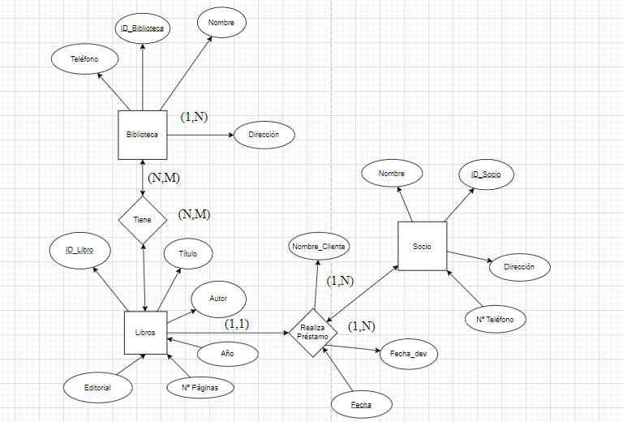
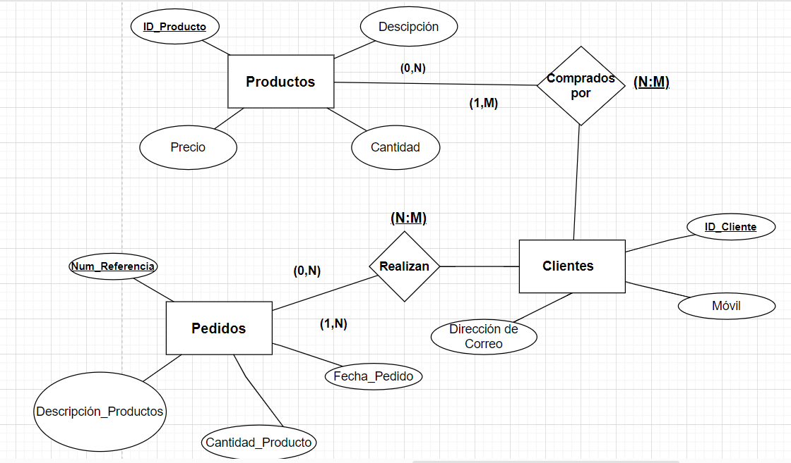

Ejercicio 1: Biblioteca
Descripción:
Diseña una base de datos para una biblioteca que permita gestionar los libros y los préstamos.

Ejercicio 2: Tienda en línea
Diseña una base de datos para una tienda en línea que gestione productos,
clientes y pedidos.

Ejercicio 3: Sistema de gestión escolar
Diseña una base de datos para una escuela que gestione estudiantes, cursos y
matriculaciones.

